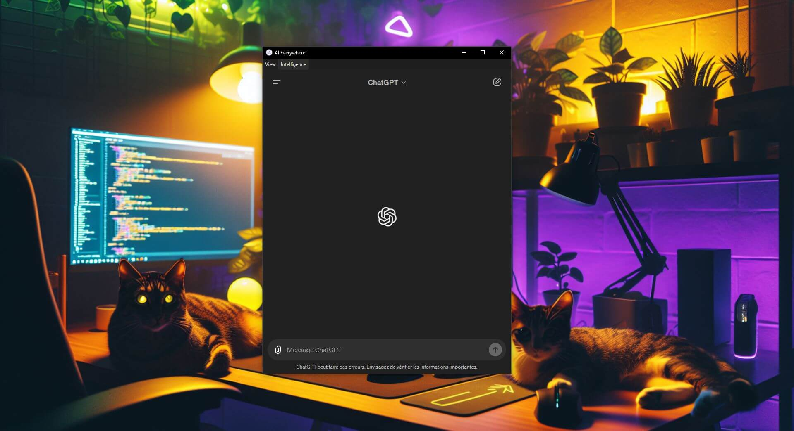

# AI Everywhere

The Intelligent Assistant app is a desktop application who integrates AI features, including ChatGPT, Mistral AI, Otio AI, Perplexity, Claude AI and Huggingface. It offers a chat interface for interacting with AIs. Views are responsive and adapt to window size. The application features an intuitive main menu, and windows always remain in the foreground. Conversations and states are preserved when tabs are changed.

**Using AI Fast !**

## Usage

### INSTALL

> npm install --save-dev electron

> ( npm install --save-dev electron@latest )

### TEST

> npm start

### DEPLOY

#### PC

> npx electron-packager . NomDeVotreApp --platform=win32 --arch=x64 --overwrite

> npx electron-packager . AI_Everywhere --platform=win32 --arch=x64 --icon=assets/icon.ico --overwrite

#### MAC 

> npx electron-packager . AI_Everywhere --platform=darwin --arch=x64 --overwrite --icon=assets/icon.icns

----

## Ressources 

ChatGPT Web

https://github.com/Niek/chatgpt-web

Electron.js

https://www.electronjs.org/fr/

